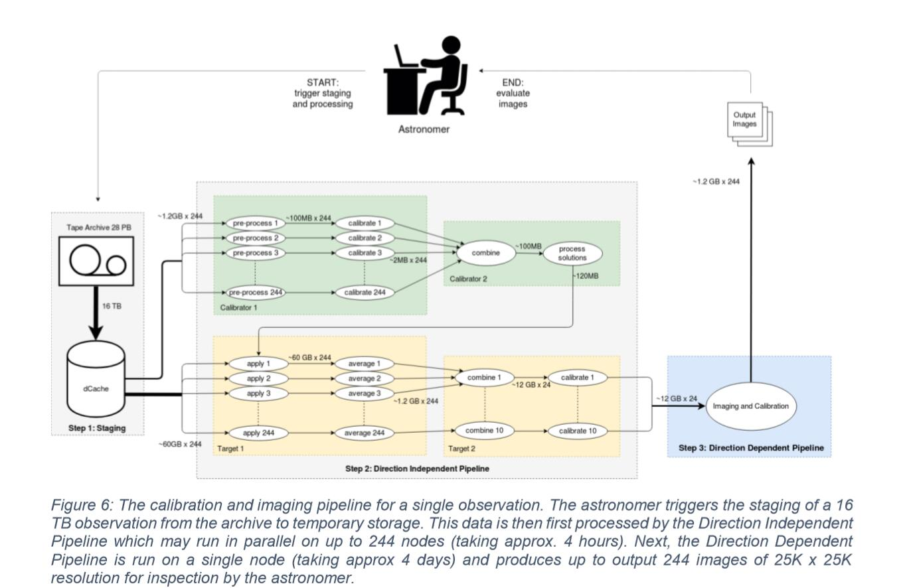

# Short review for literatures

## [PROCESS DOC USE CASE:Square Kilometre Array/LOFAR ](PUBLIC_PROCESS_D4.1_Initial_-state_of_the_art_and_requirement_analysis_initial_PROCESS_architecture_v1-1.pdf)
The PROCESS is a solution aiming to handle heterogenous exascale use cases driven by both the scientific research community and the industry. One use case it covers is to process the observation from LOFAR. 

In this case, the goal is to provide a user friendly system that astronomers can easily utilize by clicking and they only need to focus on their own field.The use case can be abstracted as it is shown in the figure below.The data is firstly staged and divided into multiple subsets.There are two different and separate calibration stages, the key is that whether it is direction dependent or independent.The output of DD calibration stage will be used for DI calibration, which means there's an order between two of them. 

DI uses the pre-FACTOR package to perform the initial calibration which can be parallel. DD is an iterative procedure on the target field, which is called self calibration. It is currently implemented using the DDF package on a single node (using all the cores of one high-end CPU). *Which one is the stage that this master project should concern? Or both of it?*

In this figure, the number of division is fixed and determined by the number of processors. (or division of sky map?). `one question is that whether each division is fixed whole job.` If so, there might be a bottleneck that the overall processing time is determined by the slowest one. It maybe a room for work stealing to solve load imbalance problem. `Another thing that should concern is that  whether it can be scaled horizontally.` Since the number of processors is very certain

The PROCESS project focuses on computation at the high level. The workflow is based on the use of the Common Workflow Language (CWL) and Docker / Singularity. This workflow mentioned is part of project EOSCpilot.

### Important reference
*  EOSCpilot project 
*  pre-FACTOR [https://github.com/lofar-astron/prefactor] 
*  DDF [https://github.com/mhardcastle/ddf-pipeline] 

## [Unlocking the LOFAR LTA](/Literature/Unlocking&#32;the&#32;LOFAR&#32;LTA.pdf)

The LOFAR LAT  was set up to store all LOFAR observations. In this paper, how PROCESS tackles on the exscale data is covered. The implementation consists of several parts including: web interface, DDF pipeline, CWL & Xenon and data service. 

The Web interface is related to the interaction with users which is not what we should mainly concern. The DDF pipeline is taken charge by *prefactor* which is also mentioned in PROCESS document. I think this part is related to what we are going to do for calibration, however, this paper does not talk about it a lot. Maybe it is because this part is a black box or fixed package for the solution and it is not the main point of innovation. For our problem, this part probably can be viewed as black box as well, but we should go down to how this pipeline is invoked.

In section II.C, CWL & Xenon, how DDF pipeline is organized is explained. I don`t know whether this is the current solution for calibration in real practice. However, this can be also a good source to learn. According to the example, the DDF pipeline is decomposed into multiple phases vertically. The Ibis framework is good at scaling horizontally, which means the nodes basically are working with same tasks, after all nodes are sharing the same code (of course, Ibis can certainly be applied to this workflow; and Constellation may help as well). 

The last part is Data service. I think we should take care about it, as data locality is a vital part of performance and how data are stored and accessed is something we can not ignore. There are a lot of technologies mentioned, but it is not very clear to see the detail, meanwhile there is no reference talking about the decision making on technologies.

In the last paragraph of the paper, it mentions that the DI part can be parallelized while DD part of calibration not. I am not sure which part is the one that we talked about that using Ibis to replace MPI and Spark.

### Important reference

*  CWL & Xenon 

## Towards a new paradigm for programming scientific workflows

This paper aims to purpose a new programming paradigm for scientific computing.